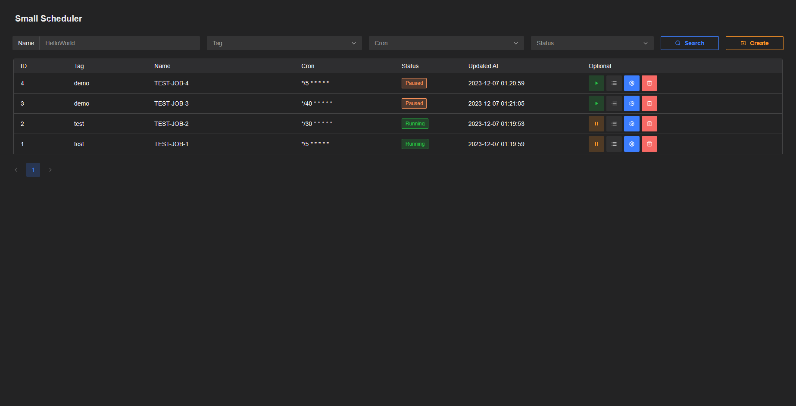
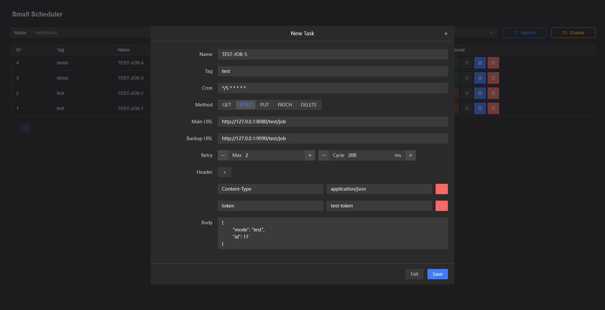
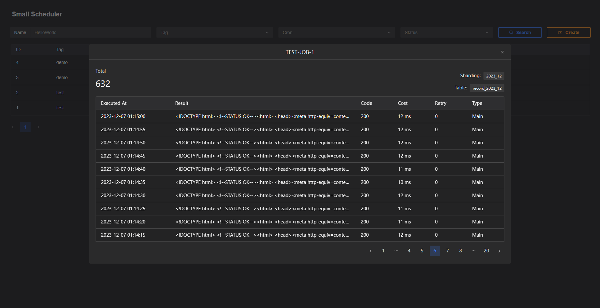

# Small Scheduler

## 一个基于 Go + MySQL + Cron 的分布式定时任务调度平台

### 特点
* 无状态分布式服务，部署流程简单，通过乐观锁控制并发，确保同一时刻同一任务只会被一个服务实例执行。
* 任务调度基于HTTP请求，支持`GET`、`POST`、`PUT`、`PATCH`、`DELETE`方法，支持自定义请求体与请求头。
* 支持自定义设置调度失败重试规则（最大重试次数、重试间隔时间）及备用HTTP调度地址。
* 自带网页控制台，可视化配置定时任务。
* 支持存储与查询各任务的调度记录，按年月划分，自动分表。
* 支持健康检查及平滑关闭服务。

***

## 使用方式
### 1、编辑项目配置文件 `config.yaml`
* 一般只用改数据库配置，其他配置默认即可
```yaml
# 服务配置
server:
  # 服务端口号
  port: 9088
  # 服务路径前缀
  context-path: /v1
# 数据库配置
db:
  # 数据库链接（指定一个新建的MySQL数据库即可，会自动建表）
  dsn: root:123456@tcp(127.0.0.1:3306)/small_scheduler?charset=utf8mb4&parseTime=True&loc=Local
# 日志配置
log:
  # 单个日志文件最大容量（单位：mb）
  max-size: 1
  # 日志文件存活时间（单位：天）
  max-age: 7
  # 最多可以存在多少个日志文件
  max-backups: 1000
# 平滑关闭实例配置
shutdown:
  # 调用实例关闭接口10秒后停止实例
  wait-time: 10
```
### 2、运行 `main.go` 或使用 `go build main.go` 命令将程序编译成可执行文件后，再运行可执行文件
### 3、访问网页控制台 `http://localhost:9088/v1/web/`
### 4、在网页上配置与管理定时任务（如下图所示）





***

## 将项目源码打包成可执行文件
```
go build main.go
```

***

## 后台接口

### 实例健康检查接口

> `GET` http://localhost:9088/v1/health

* 正常情况：HTTP状态码返回`200`
* 正在等待关闭服务：HTTP状态码返回`400`
 
### 平滑关闭实例接口

> `DELETE` http://localhost:9088/v1/shutdown

* 调用`shutdown`接口后，会在等待一段时间后关闭该实例，等待期间只会继续执行那些已经在执行过程中的任务，不会再加载新的任务（避免正在运行的任务突然被打断）