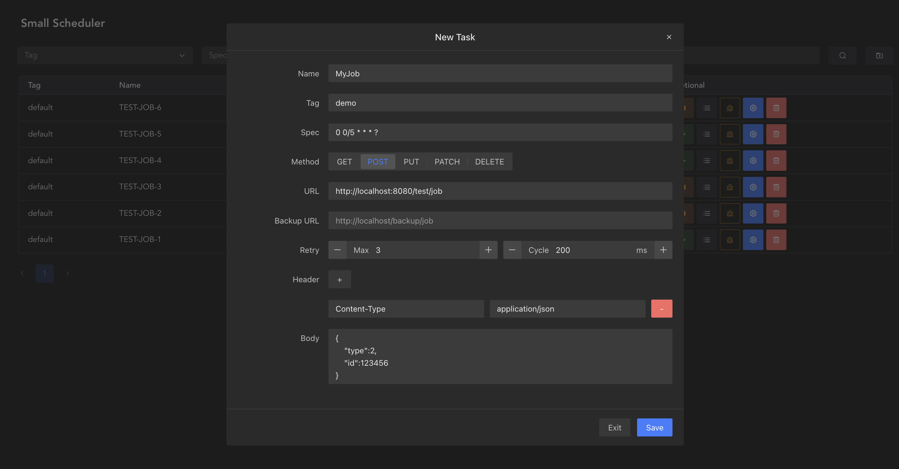
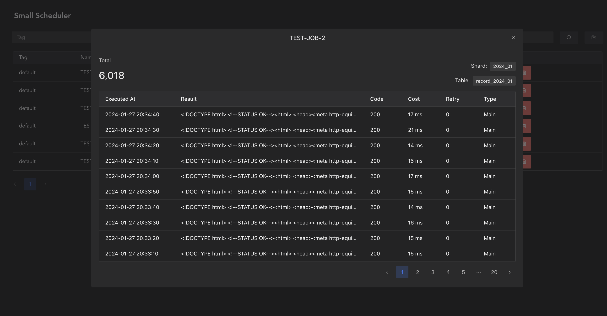

# Small Scheduler

## 一个基于 Go + MySQL 的分布式定时任务调度平台

### 特点

* 无状态分布式服务，只依赖 `MySQL` 数据库，部署流程简单，通过乐观锁控制并发，确保同一时刻同一任务只会被一个服务实例执行
* 使用HTTP Webhook触发任务，无代码侵入，支持`GET`、`POST`、`PUT`、`PATCH`、`DELETE`方法，支持自定义请求体与请求头
* 自带网页控制台，可视化配置定时任务，支持设置调度失败重试规则（最大重试次数、重试间隔时间）及备用HTTP调度地址
* 支持存储与查询各任务的调度记录，按年月划分，自动分表
* 支持健康检查及平滑关闭服务





***

## 使用方式
* 1、编辑项目配置文件 `config.yaml`，一般只用改数据库配置，其他配置默认即可
* 2、运行 `main.go` 或使用 `go build main.go` 命令将程序编译成可执行文件`main`/`main.exe`后，再运行程序
* 3、访问网页控制台 http://localhost:9088/v1/web/
* 4、在网页上配置与管理定时任务

***

## 编译并运行

### 源代码编译

```
go build main.go
```

#### 将编译后生成的可执行文件main与配置文件config.yaml、页面文件夹web放在同一目录下

* 运行目录
  * main
  * config.yaml
  * web
    * css
    * js
    * index.html

### Mac/Linux环境下运行

cd 到运行目录，执行命令

```
./main
```

### Windows环境下运行

双击`main.exe`运行程序

***

## 后台接口

### 实例健康检查接口

> `GET` http://localhost:9088/v1/health

* 正常情况：HTTP状态码返回`200`
* 正在等待关闭服务：HTTP状态码返回`400`
 
### 平滑关闭实例接口

> `GET` http://localhost:9088/v1/shutdown?wait=10

* 该接口仅限本机调用（只能使用`localhost`、`127.0.0.1`、`0.0.0.0`这三个hostname访问）
* 参数 `wait` : 等待关闭时间（单位-秒），必须大于0
* 调用`shutdown`接口后，会在等待10秒后关闭该实例，等待期间只会继续执行那些已经在执行过程中的任务，不会再加载新的任务（避免正在运行的任务突然被打断）